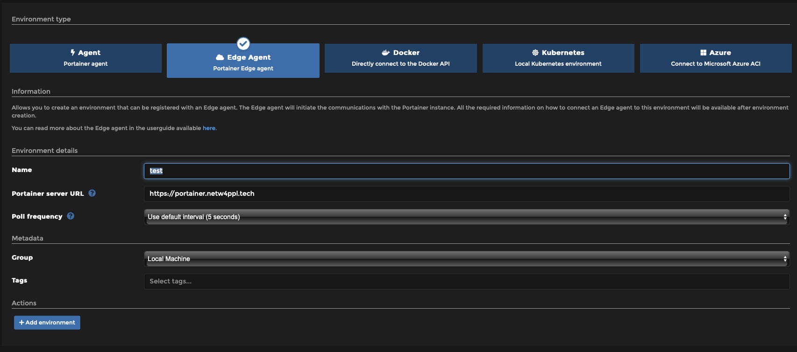
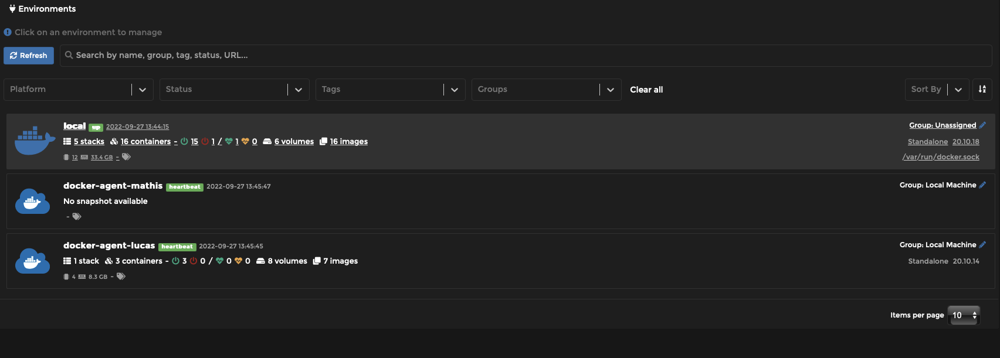

# website

Site web du projet :)


# Start the project

## Using docker

### Using portainer on your machine

You can go to [https://portainer.netw4ppl.tech](https://portainer.netw4ppl.tech) to manage the docker server but also
your machine locally, providing you the ability to register your machine.

To do so:

- Connect to the portainer space with the credentials present in the keepass
- Go to *Environments*.
  - Add an environment
  - Choose *Edge Agent* and enter a name, choose the group *Local Machine* and leave the other parameters as default
  - Click on *Add environment*.



Depending on your configuration, choose the right deployment script. For mac and wsl, it is possible to choose Linux and
docker standalone.

- Copy the script and run it on your machine.
- Finish by clicking on *Update environment*.

You should find your machine in *Home*.



### How to run the project?

1. Clone the github project
2. With portainer, create a new *stack*.
  1. Choose *custom template* and choose the *n4p-website* template
  2. Adapt the compose according to the deployment environment

**IMPORTANT** :

It is necessary to **add the environment variables** which define the identifiers of the database.

Your must correctly create and associate the volumes (*you can create theses directories wherever you want, as long as you
associate them correctly in the docker compose*)

- `/var/N4P/sql-volume` : to store the data of the database
- `/var/www/website/` : path to the website source code (if cloned from github, be careful to point to the `src` folder)
- `/srv/www/web_apps/website/ssl`: :warning: **Not necessary if ssl is not required**
- `/etc/apache2/sites-available/docker_config.conf` points to an apache configuration file (see below)

#### Here is the apache configuration file required by `/etc/apache2/sites-available/docker_config.conf`

```apacheconf
# conf/vhost.conf
<VirtualHost *:80>
    DocumentRoot /var/www/html/public

    <Directory "/var/www/html">
        AllowOverride all
        Require all granted
    </Directory>

    ErrorLog ${APACHE_LOG_DIR}/error.log
    CustomLog ${APACHE_LOG_DIR}/access.log combined
</VirtualHost>

# Delete the lines below if you don't use ssl 
<IfModule mod_ssl.c>
<VirtualHost *:443>
    DocumentRoot /var/www/html/public

    <Directory "/var/www/html">
        AllowOverride all
        Require all granted
    </Directory>

    SSLCertificateFile /var/imported/ssl/fullchain.pem
    SSLCertificateKeyFile /var/imported/ssl/privkey.pem
    SSLEngine on
</VirtualHost>
</IfModule>
``` 

3. Deploy the stack

#### Finalize the configuration :

4. Make sure there is a `.env` file in your source directory. This file is required by Laravel to run the project

You can use the following template paying particular attention to the following elements:

- `APP_DEBUG` : if true, Laravel displays error log (only use it in dev mode)
- `DB_HOST` : if you use docker, you have to put the sql docker container's name
- `DB_DATABASE`: the name of the DB you had defined in the docker composer environment (step 2)
- `DB_USERNAME` : the username you had defined in the docker composer environment (step 2)
- `DB_PASSWORD` : the password you had defined in the docker composer environment (step 2)
- `DEFAULT_EMAIL` : the email for the default account
- `DEFAULT_PASSWORD` : the password for the default account
- `DEFAULT_TEAM` :  the default team

```.env
APP_NAME=Laravel
APP_ENV=local
APP_KEY=
APP_DEBUG=true
APP_URL=

LOG_CHANNEL=stack
LOG_LEVEL=debug

DB_CONNECTION=mysql
DB_HOST=sql_container_name
DB_PORT=3306
DB_DATABASE='database_name'
DB_USERNAME=USER
DB_PASSWORD='PASSWORD'

BROADCAST_DRIVER=log
CACHE_DRIVER=file
QUEUE_CONNECTION=sync
SESSION_DRIVER=database
SESSION_LIFETIME=120

MEMCACHED_HOST=127.0.0.1

REDIS_HOST=127.0.0.1
REDIS_PASSWORD=null
REDIS_PORT=6379

MAIL_MAILER=smtp
MAIL_HOST=mailhog
MAIL_PORT=1025
MAIL_USERNAME=null
MAIL_PASSWORD=null
MAIL_ENCRYPTION=null
MAIL_FROM_ADDRESS=null
MAIL_FROM_NAME="${APP_NAME}"

DEFAULT_EMAIL="default user email"
DEFAULT_PASSWORD="default user password"
DEFAULT_TEAM="default user team"

TRANSLATION_API_URL="ENTER THE URL"
TRANSLATION_API_TOKEN="YOUR API TOKEN"
```

5. Run the following commands :

**:warning: These commands MUST be run within the application docker container**

```bash
npm update
cd /var/www/html
composer update
php artisan cache:clear
composer dump-autoload
php artisan key:generate
chmod -R 777 storage/
php artisan migrate:refresh --seed
```

# N4P API

You can find the API documentation
here : [https://documenter.getpostman.com/view/15399454/2s83tJGAMW](https://documenter.getpostman.com/view/15399454/2s83tJGAMW)
