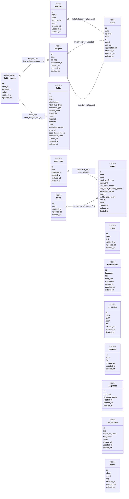

```mermaid
classDiagram
	direction RL
	
	class crews {
		id
		name
		created_at
		updated_at
		deleted_at
	}
	<<table>> crews
	
	class refugees {
		id
		date
		api_log
		application_id
		created_at
		updated_at
		deleted_at
	}
	<<table>> refugees
	
	class fields {
		id
		title
		label
		placeholder
		html_data_type
		database_type
		android_type
		linked_list
		status
		required
		attribute
		order
		validation_laravel
		crew_id
		best_descriptive_id
		descriptive_value
		created_at
		updated_at
		deleted_at
	}
	<<table>> fields
	
	class field_refugee {
		id
		field_id
		refugee_id
		value
		created_at
		updated_at
	}
	<<pivot_table>> field_refugee
	fields <|--|> field_refugee : fields(id) = field_refugee(field_id)
	refugees <|--|> field_refugee : refugee(id) = field_refugee(refugee_id)
	
	class links {
		id
		date
		relation
		from
		to
		detail
		api_log
		application_id
		created_at
		updated_at
		deleted_at
	}
	<<table>> links
	
	class relations {
		id
		name
		color
		importance
		short
		created_at
		updated_at
		deleted_at
	}
	<<table>> relations
	links <|--|> relations : links(relation) = relations(id)
	links <|--|> refugees : links(from) = refugee(id)
	links <|--|> refugees : links(to) = refugee(id)
	
	class users {
		id
		name
		email
		email_verified_at
		password
		two_factor_secret
		two_factor_recovery_codes
		remember_token
		crew_id
		profile_photo_path
		role_id
		token
		created_at
		updated_at
		deleted_at
	}
	<<table>> users
	
	class user_roles {
		id
		role
		importance
		created_at
		updated_at
		deleted_at
	}
	<<table>> user_roles
	users <|--|> user_roles : users(role_id) = user_roles(id)
	users <|--|> crews : users(crew_id) = crews(id)
	
	class routes {
		id
		short
		full
		created_at
		updated_at
		deleted_at
	}
	<<table>> routes

	class translations {
		id
		language
		list
		field_key
		translation
		created_at
		updated_at
		deleted_at
	}
	<<table>> translations
	
	class countries {
		id
		ISO2
		ISO3
		short
		full
		created_at
		updated_at
		deleted_at
	}
	<<table>> countries
	
	class genders {
		id
		short
		full
		created_at
		updated_at
		deleted_at
	}
	<<table>> genders
	
	class languages {
		id
		language
		language_name
		created_at
		updated_at
		deleted_at
	}
	<<table>> languages
	
	class list_controls {
		id
		title
		displayed_value
		key_value
		name
		created_at
		updated_at
		deleted_at
	}
	<<table>> list_controls
	
	class roles {
		id
		short
		descr
		key
		created_at
		updated_at
		deleted_at
	}
	<<table>> roles
	
	
	
```

